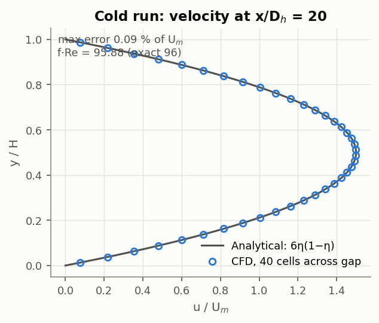
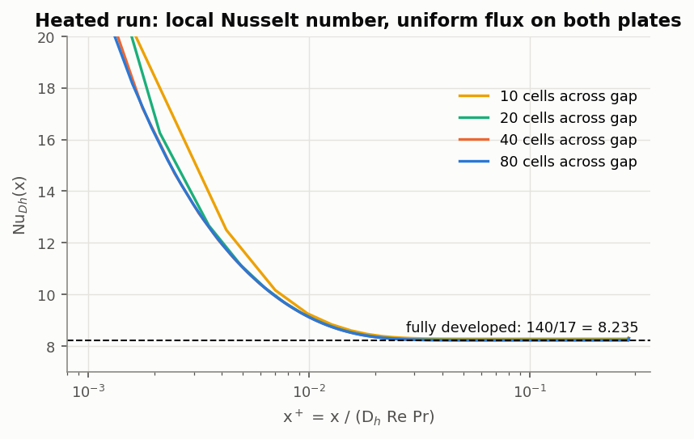
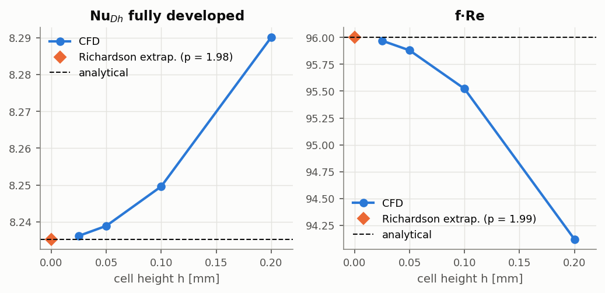
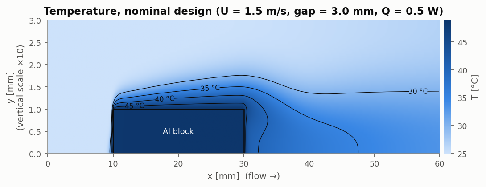
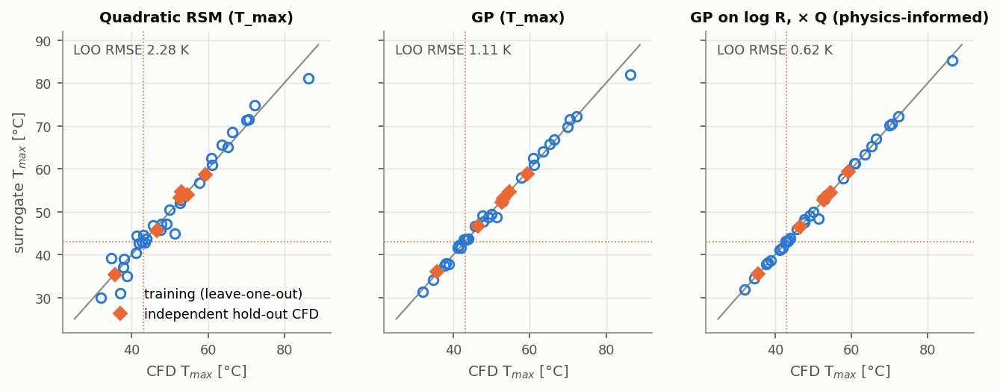
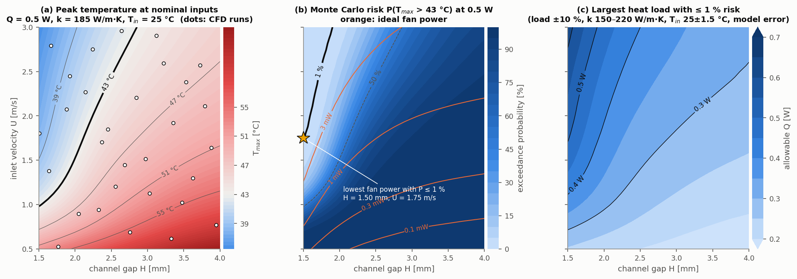
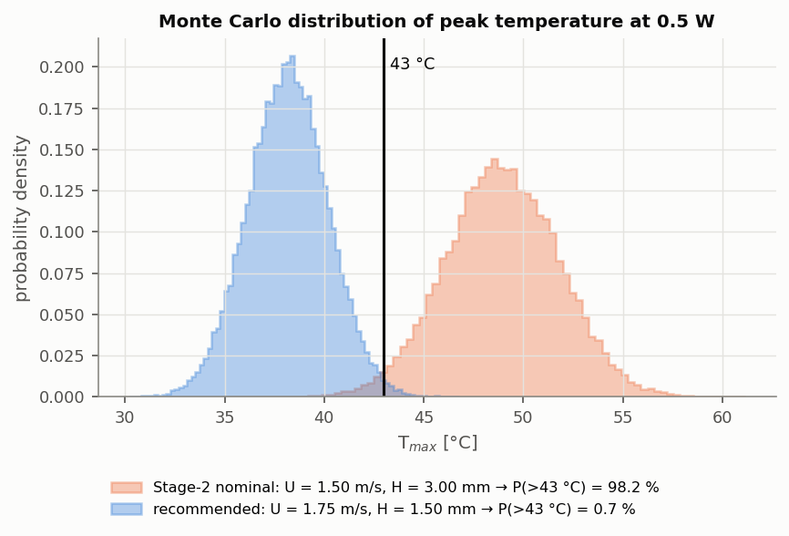
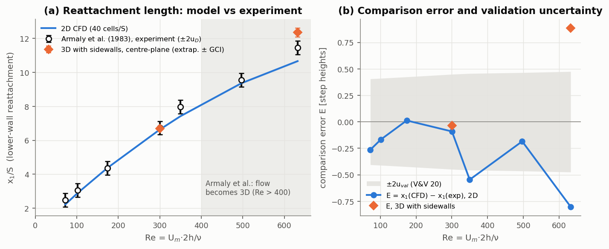

# Forced-air cooling of a heat source in a thin wearable channel

[](https://github.com/<your-user>/wearable-cooling-cfd/actions/workflows/ci.yml)

A 2D conjugate heat-transfer (CHT) model, built in OpenFOAM, of a heated aluminium block (standing in for a battery or SoC) inside the thin air channel of a headset arm. It is driven end to end from Python. The model answers one design question:

> **What channel gap and airflow keep the hottest point below the 43 °C skin-contact comfort limit, and how confident can we be?**

**Short answer (for 0.5 W, 25 °C inlet air):** only narrow gaps with fast air are safe. With a 1.5 mm gap (0.5 mm of clearance above the 1 mm block), you need **U ≥ 1.75 m/s** to keep the probability of exceeding 43 °C at or below 1 %. That costs about **6 mW of ideal fan power**. The "obvious" starting design (3 mm gap, 1.5 m/s) runs at **48.9 °C** and fails 98 % of the time. Across the whole design space, the load this channel can safely remove ranges from **0.16 W to 0.62 W**, so dissipating 1–3 W in a channel this thin needs a heat-spreading path to the housing, not forced air alone.

| Stage | What it shows | Key numbers |
|---|---|---|
| 1. Verification | The solver reproduces textbook laminar channel flow and heat transfer | Richardson-extrapolated Nu = **8.2353** vs 140/17 = 8.2353; f·Re = **96.001** vs 96; observed order **p = 1.98 / 1.99** |
| 2. Conjugate heat transfer | Block and air are coupled, and the solution is mesh-independent and conserves energy | T<sub>max</sub> GCI **0.08 %** on the design mesh; energy imbalance **≤ 0.07 %** |
| 3. Design study | LHS → 36 CFD runs → surrogate → Monte Carlo | Physics-informed GP: hold-out RMSE **0.12 K**; 20 000-sample MC at 1 681 design points |
| **Phase 1. Validation** ([details](validation/README.md)) | The separated flow behind the block is checked against a benchmark and against experiment, with ASME V&V 20 uncertainty accounting | Gartling benchmark within **0.2 %**; Armaly et al. experiment matched within u<sub>val</sub> for Re ≲ 500; above that, a **−7 % 2D model-form error**, which 3D runs attribute to sidewall effects |

---

## Repository layout

```
templates/            OpenFOAM case files with {{placeholders}}
  common/             region dictionaries shared by all cases (thermo, schemes, solvers)
  channel/            Stage 1: parallel-plate channel (blockMesh, BCs, Allrun)
  cht/                Stage 2/3: heated block + air, split into two regions (Allrun)
  bfs/                Phase 1: backward-facing step, 2D or 3D half-span (Allmesh/Allsolve)
coolchan/             Python package
  case.py             parameter dataclasses -> rendered case directories
  runner.py           run cases natively or in Docker, in a process pool
  foamio.py           pure-NumPy reader for ASCII polyMesh + fields (no function objects)
  verification.py     analytical solutions, channel post-processing, 3-grid GCI
  cht.py              CHT outputs: T_max, T_out, Δp, fan power, energy balance
  surrogate.py        LHS, three surrogates, leave-one-out CV, Monte Carlo
  bfs.py              BFS geometry, exact channel/duct inlet profiles, reattachment lengths
scripts/
  stage1_verification.py
  stage2_cht.py
  stage3_design.py    run | fit | mc | all
  phase1_validation.py  gartling | armaly2d | armaly3d | report
  ci_check.py         coarse smoke test used by GitHub Actions
validation/           Phase 1 write-up and reference data with provenance
results/              committed CSV / JSON / Markdown tables behind every number here
docs/figures/         figures used in this README
tests/                pytest unit tests (no OpenFOAM needed)
```

## Quick start

```bash
pip install -r requirements.txt
pytest -q                                   # unit tests, ~5 s

# OpenFOAM (openfoam.com): native install, or Docker
export COOLCHAN_DOCKER_IMAGE=opencfd/openfoam-default:2406   # optional

python scripts/stage1_verification.py       # ~7 min on 2 cores
python scripts/stage2_cht.py                # ~20 min (the fine mesh dominates)
python scripts/stage3_design.py all         # ~35 min for 36 cases on 2 cores
python scripts/stage3_design.py fit mc      # re-analyse the cached CFD in ~2 min
python scripts/phase1_validation.py         # ~2.5 h on 2 cores (3D runs up to 641 k cells)
```

Each case is self-contained, so you can also run it by hand: `cd runs/stage2/medium && ./Allrun`.

---

## Model

```
 y=H  +---------------------------------------------------+  top wall   (adiabatic, no-slip)
      |  air, laminar, constant properties                |
inlet |            +==================+                   |  outlet (p fixed)
U, 25°C   y=1 mm   |  Al block, q'''  |                   |
 y=0  +------------+==================+-------------------+  bottom wall (adiabatic)
      0           10                 30                  60   x [mm]
```

| Item | Choice | Why |
|---|---|---|
| Solver | `chtMultiRegionSimpleFoam` (steady SIMPLE, two regions) | standard openfoam.com CHT solver |
| Air | ρ = 1.1614, μ = 1.846e-5, c<sub>p</sub> = 1007, Pr = 0.707 (300 K), `rhoConst` | constant properties make the energy equation linear, so we can compare against textbook solutions |
| Flow regime | laminar; Re<sub>Dh</sub> = 118–1 200 in the design space | below transition for a smooth channel |
| Block | 20 × 1 mm, k = 120–240 W/m·K, uniform q''' = Q / (L·h·W) | 2D slice of a 20 mm-wide channel |
| Interface | `turbulentTemperatureCoupledBaffleMixed` | continuity of T and heat flux |
| Walls | adiabatic | conservative: all heat leaves through the air |
| Convection | `linearUpwind` (2nd order), cell-limited ∇h | without the limiter, T undershoots T<sub>in</sub> by 0.5 K at the block's leading corner |
| Buoyancy / radiation | off | forced convection dominates; this is a conservative omission |

All post-processing is done in Python, directly from the `polyMesh` and field files (`coolchan/foamio.py`), so the same analysis code runs on any OpenFOAM version.

---

## Stage 1: Verification (parallel-plate channel)

Channel: gap H = 2 mm, L = 100 mm (L/D<sub>h</sub> = 25), uniform inlet U = 0.5 m/s, Re<sub>Dh</sub> = 126. The flow and thermal fields develop together from the inlet. For the thermal check, both plates carry the same uniform heat flux q'' = 100 W/m². The same solver and region dictionaries are used as in the CHT model, so this verifies the code path the design study depends on.

**Cold run.** The velocity profile matches u = 6U<sub>m</sub>η(1−η) to 0.09 % of U<sub>m</sub>, and the developed pressure gradient is −27.66 Pa/m vs −27.69 exact. Because the energy equation is one-way coupled, the heated run's velocity field is bit-for-bit identical to the cold run's (max |ΔU| = 0).

<p align="center">


</p>

**Grid convergence.** There are four meshes with r = 2. GCI follows Celik et al. (2008) and is computed on the three finest:

| Quantity | Grid 3 (coarse) | Grid 2 | Grid 1 (fine) | Observed order p | Richardson extrapolation | GCI<sub>fine</sub> | Analytical | Extrap. vs exact |
|---|---|---|---|---|---|---|---|---|
| Nu<sub>Dh</sub> (fully developed) | 8.2496 | 8.2389 | 8.2362 | 1.98 | 8.2353 | 0.014 % | 8.235 | -0.000 % |
| f·Re (Darcy) | 95.5218 | 95.8802 | 95.9704 | 1.99 | 96.0007 | 0.039 % | 96 | +0.001 % |
| Δp inlet→outlet [Pa] | 2.8680 | 2.8923 | 2.9080 | 0.62 | 2.9372 | 1.252 % | - | - |

Grids (cells across gap × along channel): 20×200, 40×400, 80×800. The asymptotic-range ratio is 1.000 for both Nu and f·Re.

<p align="center"></p>

What these numbers show:

* **The observed order matches the formal order.** The scheme is second-order, and the observed order is p ≈ 2. Richardson extrapolation lands on the exact values to 5 significant figures. This is the strongest evidence a code-verification test can give.
* **The total Δp converges at p ≈ 0.6, and that is expected.** A uniform inlet velocity meets a no-slip wall at the inlet corner, which is a velocity singularity. The singularity pollutes the integral pressure drop, but not the developed-region quantities. This is a known feature of the test and is reported here rather than hidden.
* **Energy balance closes to 4 × 10⁻⁶.** To get there, the balance has to count the axial conduction back out through the fixed-temperature inlet, which is 0.07 % of the heat input at Pe ≈ 90.
* **Iterative error is negligible.** Nu changes by < 3 × 10⁻⁸ between the last two saved iterates, which is orders of magnitude below the discretisation error.

## Stage 2: Conjugate heat transfer (nominal design)

Nominal design: U = 1.5 m/s, gap = 3 mm, Q = 0.5 W, k = 200 W/m·K, T<sub>in</sub> = 25 °C.

<p align="center"></p>

The block is almost isothermal (k<sub>Al</sub>/k<sub>air</sub> ≈ 7 600), so the temperature is set by the air-side film resistance. A thermal boundary layer grows along the block. Behind the trailing edge, a recirculation zone about 8 mm long (x = 30–38 mm) holds warm air against the downstream face of the block.

| Mesh | Cells | T<sub>max</sub> solid [°C] | T<sub>out</sub> air [°C] | Δp [Pa] | Fan power [mW] | Energy imbalance | Iterative ΔT<sub>max</sub> [K] |
|---|---|---|---|---|---|---|---|
| coarse (Δy = 0.1 mm) | 4,500 | 48.977 | 29.750 | 5.785 | 0.521 | -0.070 % | 0.0e+00 |
| medium (Δy = 0.05 mm) | 18,000 | 48.924 | 29.750 | 5.821 | 0.524 | -0.018 % | 4.0e-07 |
| fine (Δy = 0.025 mm) | 72,000 | 48.913 | 29.748 | 5.842 | 0.526 | -0.037 % | 2.1e-05 |

| Output | Observed order p | Richardson extrapolation | GCI<sub>fine</sub> | GCI<sub>medium</sub> |
|---|---|---|---|---|
| T<sub>max</sub> solid [°C] | 2.20 | 48.910 | 0.02 % | 0.08 % |
| Δp [Pa] | 0.75 | 5.873 | 0.66 % | 1.11 % |

* The **medium mesh is used for the design study**. Its GCI on the temperature rise is 0.08 % (about 0.02 K), well below the surrogate error (hold-out RMSE 0.12 K).
* **Energy check:** the enthalpy rise of the air matches the heat generated in the block to within 0.07 % on all three meshes. The outlet temperature also matches the hand calculation T<sub>in</sub> + Q/(ṁc<sub>p</sub>) = 29.75 °C.
* **Linearity check:** doubling Q to 1 W changes the thermal resistance R = (T<sub>max</sub> − T<sub>in</sub>)/Q by only 4 × 10⁻⁵, which is at iterative tolerance. Stage 3 exploits this.

## Stage 3: Design study (LHS → CFD → surrogate → Monte Carlo)

**Design of experiments.** A 30-point space-filling Latin hypercube (scipy `qmc`, centred-discrepancy optimised) covers four inputs:

| Input | Range |
|---|---|
| inlet velocity U | 0.5–3.0 m/s |
| gap H | 1.5–4.0 mm |
| heat load Q | 0.2–1.0 W |
| block conductivity k | 120–240 W/m·K |

A separate 6-point LHS, with a different seed, gives an **independent hold-out set**. `stage3_design.py run` edits the templates, runs the cases in a process pool, and parses them into [`results/doe.csv`](results/doe.csv). Finished cases are cached, so a re-run only computes what changed. Every case is checked automatically for energy balance, iterative change and residuals.

**Surrogates.** Three surrogates are scored by leave-one-out cross-validation and on the hold-out CFD runs:

| Surrogate | LOO RMSE [K] | LOO max error [K] | LOO R² | Hold-out RMSE [K] | Hold-out max error [K] |
|---|---|---|---|---|---|
| Quadratic RSM (T_max) | 2.279 | 6.457 | 0.9687 | 0.894 | 1.735 |
| GP (T_max) | 1.115 | 4.347 | 0.9925 | 0.338 | 0.525 |
| **GP on log R, × Q (physics-informed)** | **0.625** | **2.968** | **0.9976** | **0.119** | **0.258** |

<p align="center"></p>

The physics-informed model uses the property shown in Stage 2: with constant properties, T<sub>max</sub> − T<sub>in</sub> = Q·R(U, H, k) exactly. Instead of making a regressor rediscover linearity in Q, the GP (Matérn-5/2, anisotropic) learns log R over three inputs. This halves the cross-validation error. The largest LOO miss (3 K) is at a corner of the space (U = 0.53 m/s, gap 1.77 mm), where there are no neighbouring points to interpolate from. In the hold-out set, where points are interior, the maximum error is 0.26 K.

**Monte Carlo.** At each of 41 × 41 (H, U) design points, the model draws 20 000 samples from these uncertain inputs:

* heat load: Q = 0.5 W ± 10 % (1σ, normal)
* conductivity: k ~ U(150, 220) W/m·K (alloy and temper not controlled)
* inlet air: T<sub>in</sub> = 25 ± 1.5 °C (normal)
* **the GP's own predictive uncertainty on log R**

Because T is linear in Q and T<sub>in</sub>, the model can also compute exactly the **largest load that keeps the risk ≤ 1 %**, as a quantile rather than by bisection (panel c).

<p align="center"></p>

| U [m/s] | Gap H [mm] | T<sub>max</sub> at 0.5 W, nominal inputs [°C] | P(T<sub>max</sub> > 43 °C) at 0.5 W | Max. power for ≤ 1 % risk [W] | Ideal fan power [mW] |
|---|---|---|---|---|---|
| 1.0 | 1.5 | 42.8 | 45.3 % | 0.37 | 1.82 |
| 1.0 | 2.5 | 50.1 | 99.3 % | 0.26 | 0.29 |
| 1.0 | 4.0 | 56.8 | 100.0 % | 0.21 | 0.15 |
| 2.0 | 1.5 | 37.5 | 0.3 % | 0.53 | 8.33 |
| 2.0 | 2.5 | 44.4 | 71.0 % | 0.34 | 1.38 |
| 2.0 | 4.0 | 49.3 | 98.6 % | 0.27 | 0.79 |
| 3.0 | 1.5 | 35.6 | 0.0 % | 0.62 | 18.78 |
| 3.0 | 2.5 | 41.6 | 25.7 % | 0.40 | 3.65 |
| 3.0 | 4.0 | 46.1 | 87.4 % | 0.31 | 2.19 |

<p align="center"></p>

**Design takeaways**

1. **At 0.5 W, only 4.8 % of the explored space is safe (P ≤ 1 %).** All of it has a narrow gap and fast air.
2. **The gap matters more than the fan.** At a fixed inlet velocity, halving the clearance over the block roughly doubles the local air speed and thins the thermal boundary layer. At 1 m/s, going from a 4 mm to a 1.5 mm gap lowers T<sub>max</sub> from 56.8 to 42.8 °C. Tripling the fan speed at a 4 mm gap only gets to 46.1 °C.
3. **The lowest-fan-power safe design is H = 1.5 mm, U = 1.75 m/s** (≈ 6 mW ideal, 117 Pa). This sits on the edge of the explored range. Smaller gaps look attractive, but they would need new CFD runs before being trusted, and they are likely limited by manufacturing tolerance and acoustic noise.
4. **Forced air alone tops out at about 0.6 W** in this geometry. Dissipating 1–3 W would need conduction into the housing or a larger wetted area (fins).

---

## Phase 1: Validation against experiment

The recirculation zone behind the block is a backward-facing-step flow. Phase 1 validates that flow physics in three steps:

* **against a numerical benchmark:** Gartling 1990, Re = 800;
* **against experiment:** Armaly et al. 1983, laminar air flow at 7 Reynolds numbers;
* **with 3D sidewall runs:** to find out where the 2D model stops being adequate.

Full write-up, data provenance and uncertainty assumptions: [**validation/README.md**](validation/README.md).

<p align="center"></p>

* **Benchmark:** all three separation and reattachment points converge at second order and extrapolate to within **0.2 %** of Gartling (1990).
* **Experiment:** the 2D laminar model agrees with Armaly et al. within the V&V 20 validation uncertainty up to Re ≈ 500 (5 of 6 points). The flagged point at Re = 350 is out of line with its neighbours. At Re = 632, a **−0.80 S (−7 %) model-form error** is detected.
* **3D attribution:** runs with the real sidewalls (up to 641 k cells, three meshes) show the sidewalls change the result by only +0.04 S at Re = 300 but lengthen the bubble by **+1.3 to +1.7 S** at Re = 632. The experiment falls between the 2D and 3D predictions. Our leading hypothesis is the inlet condition: the experiment's sidewall boundary layers were probably not fully developed.
* **Consequence for the design model:** above Re ≈ 400–500, 2D slices carry an error of order 10 % in the recirculation length. The wearable channel's aspect ratio is smaller than the experiment's, so the effect should be at least as strong there. This is the quantitative case for Phase 2 (3D).
* **Still open:** heat-transfer validation, for example against Aung (1983) on laminar heat transfer behind a step. Those data are not openly available.

## Verification, validation and limitations

* **Verification vs validation.** Stage 1 is *code verification* (the equations are solved correctly), and Stage 2's GCI is *solution verification* (the mesh is fine enough). Phase 1 adds *validation* of the separated-flow physics against experiment. Heat transfer has not yet been validated against measurements.
* **One DOE case (train_05: U = 2.8 m/s, gap = 1.67 mm) did not converge to a steady state.** Its residuals stall at about 3 × 10⁻², which suggests the separated flow behind the block wants to be unsteady there. Its T<sub>max</sub> is iteratively stable to 10⁻⁴ K and its energy balance closes to 0.45 %, so it is kept in the fit. A transient `chtMultiRegionFoam` check would settle it.
* **The model is 2D.** It ignores spanwise leakage around the block and side-wall effects, and all heat goes to the air through adiabatic walls. This is conservative for T<sub>max</sub>, but real headsets also conduct heat into the shell, which is exactly where the skin-contact limit applies. A 3D model with a housing region and a skin-side contact resistance is the realistic extension.
* **Fan power is ideal** (Δp × flow). A real fan curve and efficiency (typically 10–30 % at this scale) should be applied before comparing designs on power.
* **Toolchain.** The committed results were produced with **OpenFOAM v1912** (openfoam.com, Ubuntu package). CI runs the coarse cases with **v2406** in the official `opencfd/openfoam-default` image. The dictionaries use syntax common to both releases.

## Continuous integration

[`.github/workflows/ci.yml`](.github/workflows/ci.yml) has two jobs:

1. **unit-tests**: runs pytest on the template renderer, the field parser, the GCI algorithm (checked against synthetic data with a known order), the LHS stratification, the surrogates, and the Monte Carlo allowable-load identity.
2. **openfoam-smoke**: pulls `opencfd/openfoam-default:2406` and runs the coarse channel, coarse CHT and coarse Gartling backward-facing-step cases through the same Python runner (`COOLCHAN_DOCKER_IMAGE`). It fails the build if any of these checks fail:
   * Nu is not within 1.5 % of 140/17
   * f·Re is not within 3 % of 96
   * u(y) is not within 3 % of Poiseuille
   * the energy balance does not close
   * the CHT T<sub>max</sub> drifts more than 1 K from the committed reference
   * the step-flow separation and reattachment points are not within 5 % of Gartling (1990)

   Logs and a JSON report are uploaded as build artifacts.

## References

* Shah, R.K. & London, A.L. (1978). *Laminar Flow Forced Convection in Ducts*. Academic Press.
* Incropera, F.P. et al. *Fundamentals of Heat and Mass Transfer*, Table 8.1 and Table A.4.
* Celik, I.B. et al. (2008). Procedure for estimation and reporting of uncertainty due to discretization in CFD applications. *J. Fluids Eng.* 130, 078001.
* Roache, P.J. (1998). *Verification and Validation in Computational Science and Engineering*. Hermosa.
