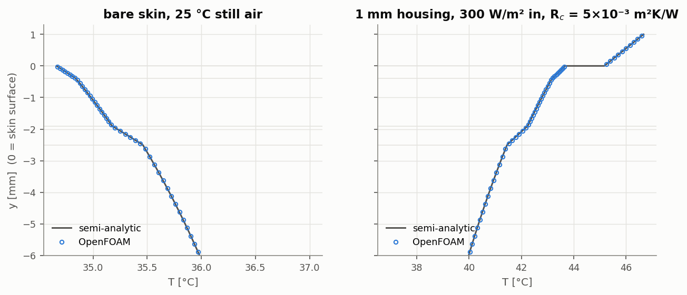
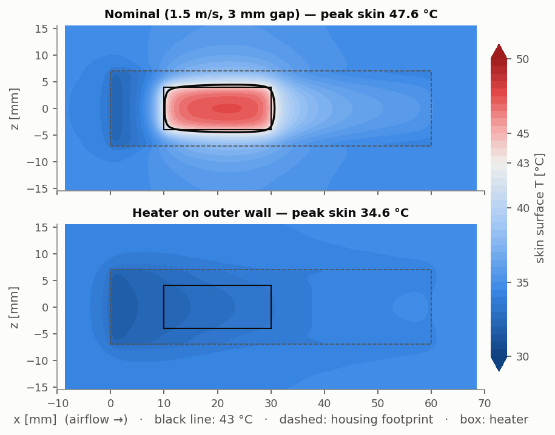
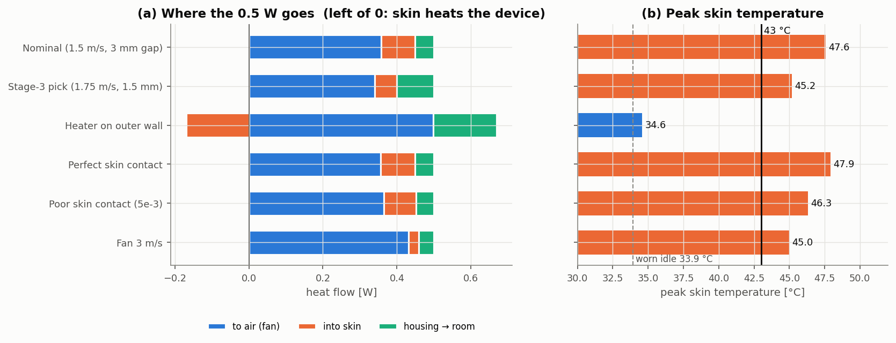

# Phase 2: 3D temple arm with the wearer's skin

`python scripts/phase2_device.py` reproduces everything on this page: about 1 hour on 2 cores, plus about 15 minutes for the fine mesh. Numbers are in `results/phase2/` and figures in `docs/figures/phase2_*`.

Stages 1–3 limited the **chip** temperature. The 43 °C comfort limit, however, applies to the **skin**. Phase 2 therefore adds three things:

* the device's plastic housing;
* the contact between housing and skin;
* four layers of living tissue.

It then asks the same design question again in 3D.

## Model

```
 y ^        room air 25 °C:  natural convection h = 5 W/m²K + radiation (ε = 0.9 plastic, 0.98 skin)
   |   +--------------------- housing top (PC, 1 mm) --------------------+
   |   |  air channel, fan-driven (laminar)       [Al heater 20×8×1 mm]   |   channel 12 mm wide, gap H
   |   +--------------------- housing bottom (PC, 1 mm) -----------------+
 0 +==== contact resistance R'' ===========================================  skin surface
   |   epidermis 0.4 mm | dermis 1.5 mm | fat 0.6 mm | inner tissue 15 mm   (Pennes bioheat)
   v   core boundary 37 °C                     tissue extends 10 mm beyond the device on every side
```

* **Geometry.** Half-width, with a symmetry plane on the centre line. The heater (20 × 8 × 1 mm, full width) sits on the skin-side housing wall; it is narrower than the channel, so air can pass beside it. The mesh is built by a small tensor-product mesher (`coolchan/lattice.py`) and split into 7 regions: air, heater, housing and four tissue layers. The design mesh has 187 k cells.
* **Tissue.** Pennes' bioheat equation, with source ω ρ<sub>b</sub> c<sub>b</sub> (T<sub>a</sub> − T) + q<sub>m</sub> in each perfused layer. The source is written as a linearised `scalarSemiImplicitSource` on enthalpy, so no custom OpenFOAM code is needed. Property values come from [*Reduced-Order Modeling of Pennes' Bioheat Equation for Thermal Dose Analysis*](https://incompliancemag.com/reduced-order-modeling-of-pennes-bioheat-equation-for-thermal-dose-analysis/) (In Compliance Magazine; originally IEEE ISPCE 2023). Blood is taken as ρ = 1060, c = 3770, T<sub>a</sub> = 37 °C.

  | Layer | Thickness [mm] | k [W/m·K] | ρ [kg/m³] | c [J/kg·K] | ω [1/s] | q<sub>m</sub> [W/m³] |
  |---|---|---|---|---|---|---|
  | Epidermis | 0.4 | 0.24 | 1200 | 3590 | – | – |
  | Dermis | 1.5 | 0.45 | 1200 | 3300 | 0.00125 | 370 |
  | Fat | 0.6 | 0.19 | 1000 | 2500 | 0.00125 | 370 |
  | Inner tissue | 15 | 0.50 | 1000 | 4000 | 0.00125 | 370 |

* **Housing–skin contact resistance.** R'' = 10⁻³ m²K/W, modelled as a thin layer inside the coupled boundary condition. **This value is assumed.** We found no open source that gives a value for plastic on skin, so the cases below bracket it from 0 (perfect contact) to 5 × 10⁻³, and Phase 5 will treat it as an uncertain input.
* **Room side.** Room air at 25 °C with natural convection h = 5 W/m²K, matching the source above. Radiation is modelled as a grey body, via the `emissivity` option of `externalWallHeatFluxTemperature`.

## Verification

**1D bioheat columns vs a semi-analytic solution.** The tissue stack is solved exactly layer by layer with a stiff ODE integrator and shooting (`coolchan/bioheat.py`). This reference is itself unit-tested against the closed-form cosh/sinh solution of a single perfused layer. The test covers three things at once:

* the Pennes source;
* the contact-resistance layer;
* the convection and radiation boundary.

| Column | Cells | T<sub>top</sub> OpenFOAM [°C] | T<sub>top</sub> semi-analytic [°C] | Max \|error\| [K] |
|---|---|---|---|---|
| bare skin | 89 | 34.6624 | 34.6625 | 9.2e-05 |
| bare skin | 178 | 34.6625 | 34.6625 | 2.6e-05 |
| bare skin | 356 | 34.6625 | 34.6625 | 1.0e-05 |
| housing on skin, 300 W/m² | 99 | 46.6727 | 46.6724 | 3.0e-04 |
| housing on skin, 300 W/m² | 198 | 46.6724 | 46.6724 | 7.6e-05 |
| housing on skin, 300 W/m² | 396 | 46.6724 | 46.6724 | 2.1e-05 |



The error falls by 3–4× per mesh doubling, which is close to second order, and is below 0.3 mK even on the coarsest column. As a plausibility check, bare skin in 25 °C still air settles at 34.7 °C, a typical skin temperature.

**3D mesh study** (nominal design, cell counts ×0.75, ×1 and ×1.33; 82 k / 187 k / 430 k cells):

| Output | coarse | medium | fine | Observed p | Richardson extrap. | GCI<sub>medium</sub> |
|---|---|---|---|---|---|---|
| Skin max [°C] | 47.675 | 47.569 | 47.490 | 0.97 | 47.243 | 1.81 % |
| Heater max [°C] | 53.047 | 52.880 | 52.752 | 0.90 | 52.313 | 2.54 % |
| Housing touch max [°C] | 48.550 | 48.435 | 48.348 | 0.93 | 48.060 | 2.00 % |
| Heat into skin [W] | 0.091 | 0.091 | 0.091 | 0.64 | 0.090 | 1.28 % |
| Δp [Pa] | 5.716 | 5.793 | 5.849 | 1.09 | 6.004 | 4.54 % |

* **Temperatures converge at about first order.** The likely cause is the heater's sharp edges and the graded outer blocks. The GCI is therefore larger than in Stages 1–2, but still small: about **±0.4 K on the peak skin temperature** of the design mesh (1.8 % of the 22.6 K rise).
* **Energy balance:** heat generated = heat to air + heat to room + heat into skin, to within 0.2 % in every case.
* **Heat-flux consistency:** the flux leaving the housing equals the flux entering the skin to 10⁻⁷.
* **Convergence:** all residuals end below 2 × 10⁻⁷.

## Results (design mesh, Q = 0.5 W unless noted)

| Case | Skin max [°C] | Skin mean under device [°C] | Housing touch max [°C] | Heater max [°C] | Heat to air / skin / room [W] | Fan [mW] |
|---|---|---|---|---|---|---|
| Nominal (1.5 m/s, 3 mm gap) | **47.6** ⚠ | 38.4 | 48.4 | 52.9 | 0.358 / 0.091 / 0.051 | 0.31 |
| Worn, idle (Q = 0) | **33.9** | 33.0 | 33.8 | 31.0 | 0.162 / -0.196 / 0.034 | 0.31 |
| Stage-3 pick (1.75 m/s, 1.5 mm) | **45.2** ⚠ | 37.8 | 45.9 | 49.6 | 0.341 / 0.059 / 0.099 | 1.21 |
| Heater on outer wall | **34.6** | 33.4 | 34.5 | 58.4 | 0.498 / -0.170 / 0.171 | 0.31 |
| Perfect skin contact | **47.9** ⚠ | 38.4 | 47.9 | 52.5 | 0.356 / 0.092 / 0.051 | 0.31 |
| Poor skin contact (5e-3) | **46.3** ⚠ | 38.2 | 50.2 | 54.2 | 0.365 / 0.087 / 0.048 | 0.31 |
| Fan 3 m/s | **45.0** ⚠ | 37.2 | 45.7 | 49.2 | 0.432 / 0.027 / 0.040 | 1.62 |





## Findings

1. **The Stage 3 recommendation fails once the skin is in the model.** The 2D study picked a 1.5 mm gap at 1.75 m/s, predicting 38 °C at the chip with a 1 % risk. In 3D with housing and skin, the same design gives **45.2 °C at the skin** and 49.6 °C at the heater. Three things the 2D model could not see explain the gap:
   * **Air bypasses the heater.** The heater does not span the channel, so air goes around it. The pressure drop is 38 Pa in 3D against 117 Pa in 2D.
   * **The heater touches the skin-side wall.** A direct conduction path runs through 1 mm of plastic into the skin.
   * **The skin is warm.** It sits at about 34 °C, not at the 25 °C ambient that the 2D walls implicitly assumed.
2. **With the heater on the skin side, the fan cannot fix it.** Doubling the fan speed to 3 m/s moves more heat into the air (0.43 W), yet the skin still peaks at 45.0 °C. The hot spot sits right under the heater, and it is set by conduction through the wall into the skin. Airflow over the heater's far side barely touches that path.
3. **Where the heater sits matters more than any fan setting.** Mounting it on the outer wall drops the skin peak to **34.6 °C**, within 1 K of wearing the device idle. The cost moves elsewhere: the outer housing reaches **56.6 °C**. That is above the 48 °C IEC 62368-1 limit for contact lasting 1 minute to 8 hours, as summarised in [Electronics Cooling (2025)](https://www.electronics-cooling.com/2025/07/thermal-design-for-externally-worn-wearable-electronics/), so it becomes a finger-touch problem instead. This trade-off is what Phase 4 (architecture and optimisation) should explore, for example with a heat spreader or insulation between heater and skin.
4. **Contact resistance moves the temperature drop more than it moves the skin peak.** From perfect contact to R'' = 5 × 10⁻³ m²K/W, the skin peak changes by only 1.6 K (47.9 → 46.3 °C). The housing surface rises by 2.3 K. The assumed value is therefore not the dominant uncertainty for skin temperature.
5. **A worn, idle device cools the skin.** With the fan running and no power, the skin loses 0.2 W into the device and sits at 33.9 °C. Under load, only about 18 % of the heat enters the skin, but it is concentrated under the heater.
6. **The 2D chip criterion is not conservative.** For the same nominal design, the 3D heater runs 4.0 K hotter than the 2D Stage 2 model predicted (52.9 vs 48.9 °C). The skin, which is what the limit actually applies to, sits 4.6 K above 43 °C.

## Limitations

* **Steady state:** these results assume the device runs at constant power long enough to reach equilibrium, which is the worst case for continuous use. Transient duty cycles are Phase 3.
* **Assumed inputs:** the contact resistance and the room-side h are assumed. The tissue properties come from one source. All of them are candidates for the Phase 5 uncertainty analysis.
* **Geometry:** the head is modelled as a flat tissue slab with a fixed 37 °C core at 17.5 mm depth, and the channel is a straight duct with open ends and a uniform fan velocity.
* **Laminar flow:** Re<sub>Dh</sub> is at most 1 130 here (the 3 m/s case), still laminar. Phase 1 showed that 3D sidewall effects matter above Re ≈ 400, and this 3D model resolves them. The steady-state assumption at the higher Re values has not yet been checked with a transient run.
