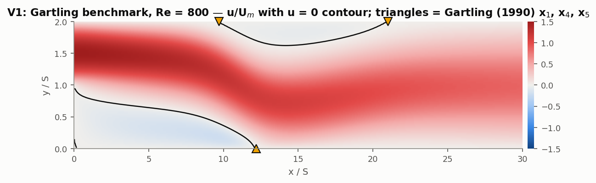
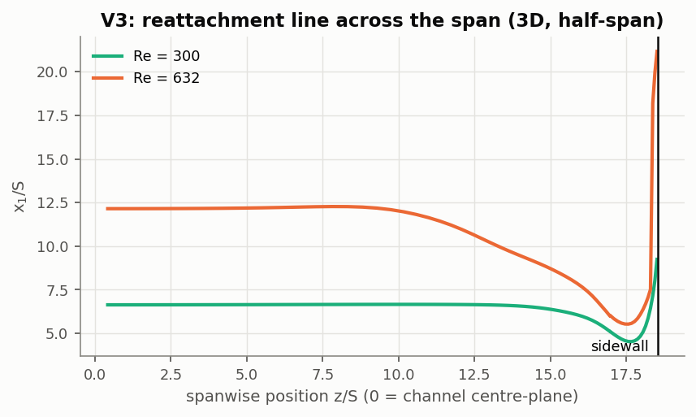

# Phase 1: Validation of the separated-flow physics

`python scripts/phase1_validation.py` reproduces everything on this page. It takes about 2.5 hours on 2 cores. Numbers are in `results/phase1/` and figures in `docs/figures/phase1_*`.

## Why a backward-facing step?

In the Stage 2 design model, air separates at the trailing edge of the heated block and recirculates over about 8 mm (8 block heights) before reattaching. That is a backward-facing-step (BFS) flow. The size of the recirculation bubble sets where the heat-transfer coefficient recovers, so it is the first piece of flow physics the design model has to get right.

The BFS has two advantages as a test case:

* one of the best-documented laminar **experiments** in fluid mechanics (Armaly et al. 1983);
* a widely used **numerical benchmark** (Gartling 1990).

| Test | Kind | Reference | What it checks |
|---|---|---|---|
| V1 | code-to-code benchmark | Gartling (1990), ER = 2, Re = 800 | solver + discretisation on a strongly separated flow, including the upper-wall bubble |
| V2 | validation against experiment | Armaly et al. (1983), ER = 1.942, 7 Reynolds numbers | the 2D laminar model vs measured reattachment lengths, with ASME V&V 20 uncertainty accounting |
| V3 | model-form attribution | same experiment, 3D with the real sidewalls | whether the 2D model's error at higher Re comes from the 2D assumption |

Re is defined as Um·2h/ν throughout, with h the inlet-channel height (Armaly's definition). Air properties match the CHT model.

## Solver

These cases are isothermal, so they use `simpleFoam` (SIMPLEC) with **the same momentum discretisation as the design model**: `linearUpwind` convection, `Gauss linear corrected` diffusion, and the same mesh style.

We first tried the CHT solver itself (`chtMultiRegionSimpleFoam`, fluid region only) on Gartling's case at 10 cells/S. It reached the same reattachment point as `simpleFoam` to within 0.1 % (x1/S = 10.72 vs 10.71). However, its residuals stalled at about 5 × 10⁻³ in this strongly separated flow, and `simpleFoam` converges to 10⁻⁹. This one-off check is recorded here but is not scripted. The same stall shows up in one Stage 3 case (train_05).

The inlet profile is written from Python as the **exact** fully developed solution:

* 2D: a parabola.
* 3D: a rectangular-duct Fourier series (White, *Viscous Fluid Flow*, eq. 3-48), unit-tested against the square-duct umax/umean = 2.096 value.

## V1: Gartling benchmark (Re = 800, ER = 2)

| Quantity | 20 cells/S | 40 cells/S | 80 cells/S | Observed p | Richardson extrap. | GCIfine | Gartling (1990) | Extrap. vs Gartling |
|---|---|---|---|---|---|---|---|---|
| x1/S lower-wall reattachment | 11.807 | 12.095 | 12.169 | 1.96 | 12.195 | 0.26 % | 12.2 | -0.05 % |
| x4/S upper-wall separation | 9.333 | 9.612 | 9.683 | 1.96 | 9.708 | 0.32 % | 9.7 | +0.08 % |
| x5/S upper-wall reattachment | 20.834 | 20.932 | 20.953 | 2.28 | 20.958 | 0.03 % | 21.0 | -0.20 % |

All three separation and reattachment points converge at second order, and they extrapolate to within 0.2 % of the benchmark. The 80 cells/S run (384 k cells) was stopped at 10 000 iterations with all residuals below 3 × 10⁻⁹; x1 changed by less than 10⁻⁴ S over its last 2 000 iterations.

## V2: Armaly et al. (1983), 2D model vs experiment

**Data.** The seven primary-reattachment lengths were digitised from Armaly et al.'s figure. We use the tabulation in the Feel++ benchmark suite; see `validation/data/armaly1983_x1.csv` for provenance.

**Mesh.** A mesh study at the hardest point (Re = 632) with 20, 40 and 80 cells/S gives observed order p = 2.08. The production level is 40 cells/S, with GCI = 0.74 %. That relative GCI is applied at every Re, which is conservative because lower Re is easier to resolve.

**Validation metric (ASME V&V 20-2009).**

* Comparison error: E = S − D, the simulated value minus the measured value.
* Validation uncertainty: uval = √(unum² + uinput² + uD²), with each component defined below.
* Rule: a model-form error is *detected* when |E| > 2uval. Otherwise the model agrees with the data to within the uncertainties.

| Component | Value (1σ) | Basis |
|---|---|---|
| unum | GCI / 2 | the GCI above is a ~95 % band |
| uinput | \|∂x1/∂Re\| × 2 % Re | assumed uncertainty of the experimental Re (velocity from LDA, ν from temperature). The slope comes from the model |
| uD | 0.20 S | **assumed.** It covers measurement plus digitisation, since neither Armaly et al. nor the tabulation give an uncertainty. This is the dominant term, so conclusions within about ±0.4 S should be read with that in mind |

| Re (Um·2h/ν) | Experiment x1/S | 2D CFD x1/S | E = S − D | unum | uinput | uD | uval | \|E\| > 2uval? |
|---|---|---|---|---|---|---|---|---|
| 72 | 2.48 | 2.22 | -0.26 | 0.01 | 0.03 | 0.20 | 0.20 | no |
| 102 | 3.05 | 2.88 | -0.17 | 0.01 | 0.04 | 0.20 | 0.21 | no |
| 174 | 4.36 | 4.37 | +0.01 | 0.02 | 0.07 | 0.20 | 0.21 | no |
| 300 | 6.73 | 6.64 | -0.09 | 0.02 | 0.10 | 0.20 | 0.22 | no |
| 350 | 7.97 | 7.42 | -0.55 | 0.03 | 0.11 | 0.20 | 0.23 | **yes** |
| 497 | 9.55 | 9.37 | -0.18 | 0.03 | 0.11 | 0.20 | 0.23 | no |
| 632 | 11.47 | 10.67 | -0.80 | 0.04 | 0.12 | 0.20 | 0.24 | **yes** |

**Reading the result:**

* **Up to Re ≈ 500**, the 2D laminar model matches the experiment to within the validation uncertainty at 5 of 6 points.
* **Re = 350 is flagged, but it looks like data scatter.** That measured point sits about 0.5 S above a smooth curve through its neighbours at Re = 300 and 497, and the model agrees with both neighbours. So the flag is more likely scatter in the data or the digitisation than a model defect.
* **Re = 632 is a real model-form error.** The 2D model under-predicts x1 by 0.80 S (−7 %), more than 3uval. Armaly et al. report that their flow became three-dimensional above Re ≈ 400. V3 tests whether that explains the error.

## V3: Is the 2D assumption responsible? 3D runs with the real sidewalls

These runs model half the span: a symmetry plane at mid-span, and the no-slip sidewall at z = W/2, where W/(S+h) = 18 as in the experiment. The inlet is the exact fully developed duct profile, scaled so that 2/3 of the centre-line maximum equals Um, which is Armaly's Re definition. Three meshes are used (12/16/20 cells/S, 36/48/60 spanwise cells, 141 k–641 k cells). Each 3D run has a 2D twin on the same in-plane mesh, which isolates the 3D increment. x1 is read on the centre-plane, where the LDA measurements were made.

| Re | Experiment x1/S | 2D (40 cells/S) | 3D with sidewalls, centre-plane (finest) | 3D Richardson extrap. | GCI (3D) | 3D − 2D increment | E (3D) |
|---|---|---|---|---|---|---|---|
| 300 | 6.73 | 6.64 | 6.64 | 6.70 | 1.1 % | +0.04 | -0.03 |
| 632 | 11.47 | 10.67 | 12.15 | 12.36 | 2.1 % | +1.31 | +0.89 |

**What V3 shows:**

* **At Re = 300 the flow stays 2D.** The sidewalls change the centre-plane x1 by only 0.04 S, and both models match the experiment (E = −0.03 S in 3D). The reattachment line is flat across about two-thirds of the half-span.
* **At Re = 632 the sidewalls lengthen the centre-plane bubble by 1.3–1.7 S.** The increment is +1.69 S on the finest mesh and +1.31 S extrapolated. The increment is not yet in the asymptotic range (p = 0.26), so we quote the range. This confirms that the 2D model's −0.80 S error is a 3D effect, and that the effect grows quickly with Re, as Armaly et al. observed.
* **The 3D model overshoots by +0.89 S, so the experiment sits between the 2D and 3D predictions.** The leading hypothesis is the inlet condition. We impose a fully developed duct profile, but a laminar duct at Re = 632 needs roughly 0.05·Re·Dh ≈ 0.3 m to develop, and Armaly's inlet section was 0.2 m long. Their sidewall boundary layers were therefore probably thinner than ours, which would weaken the 3D effect. **This is a hypothesis, not a result.** Testing it means modelling the full 0.2 m inlet in 3D, which is left as future work.

## What this means for the design model

1. **The separated-flow physics is validated at low Re.** The solver, discretisation and meshing strategy of the design model reproduce a benchmark to within 0.2 % and experiments to within their uncertainty for Re ≲ 500.
2. **Above Re ≈ 400–500, a 2D model carries a model-form error of order 10 % in the recirculation length.** The sign depends on the sidewall boundary layers. The Stage 3 design space reaches ReDh ≈ 1 200. The wearable channel's aspect ratio (width/gap ≈ 5–13) is also smaller than Armaly's 18, so sidewall effects there should be at least as strong. **This is the quantitative justification for Phase 2 (3D).**
3. **This phase validates the flow, not the heat transfer.** The next validation target is a laminar heat-transfer experiment behind a step or a heated block. Candidate: Aung (1983), *An experimental study of laminar heat transfer downstream of backsteps*, J. Heat Transfer 105, 823–829. Its data are not openly available, so they need a copy of the paper. The recirculation length validated here controls where the Nusselt-number peak sits, so V1–V3 are a necessary first step.

## References

* Armaly, B.F., Durst, F., Pereira, J.C.F. & Schönung, B. (1983). Experimental and theoretical investigation of backward-facing step flow. *J. Fluid Mech.* 127, 473–496.
* Gartling, D.K. (1990). A test problem for outflow boundary conditions—flow over a backward-facing step. *Int. J. Numer. Meth. Fluids* 11, 953–967.
* Barkley, D., Gomes, M.G.M. & Henderson, R.D. (2002). Three-dimensional instability in flow over a backward-facing step. *J. Fluid Mech.* 473, 167–190.
* ASME V&V 20-2009. *Standard for Verification and Validation in Computational Fluid Dynamics and Heat Transfer.*
* Feel++ benchmark suite: Laminar, isothermal backward-facing step (tabulated Armaly et al. data). https://docs.feelpp.org/toolboxes/latest/cfd/laminar_isothermal_backward_facing_step/index.html
